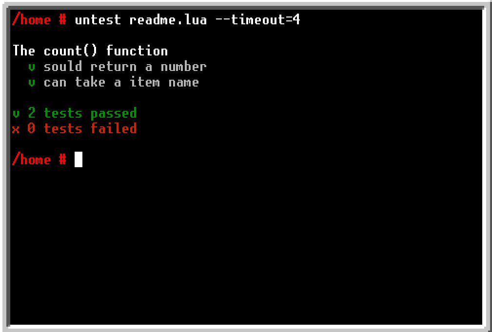

<h1 align="center">untest</h1>
<p align="center">Uncomplicated Testing for OpenComputers</p>



## Install

With [OpenPrograms](https://ocdoc.cil.li/tutorial:program:oppm)
```bash
oppm install untest
```

Or manually copy `src/untest.lua` from this repository into your `/usr/bin`
directory.

## Usage

Let's pretend we are writting a program for managing an adjacent chest.

```lua
-- my_test_file.lua

local super_inventory = require("super_inventory")

-- Our program can count the number of items in a inventory with a count().
-- function. Let's make sure it always return a number

describe("The count() function", function ()

  it("sould return a number", function ()
    -- some test
    assert(typeof(my_result) == "number")
  end)

  it("can take a item name", function ()
    local result = super_inventory.count("minecraft:stone")
    assert(result == 64)
  end)

end)
```

And then run the file:

```bash
untest my_test_file.lua
```

Note how we created an anonymous function? In this function you
can write what you want to setup the test.
Then we check if the returned value a valid number.
Then we called the `assert()` function. `assert()` throws an error if it's
argument is false.

Now we can modify `super_inventory.lua`, add features and such. If we 
somehow break the program the test will tell us! All we have to do is to 
run this file.

 - [API documentation](https://quentinrossetti.github.io/unprograms/modules/untest.html)
 - [How to use hooks](https://quentinrossetti.github.io/unprograms/examples/untest_2_hooks.lua.html)
 - [How to use timeout](https://quentinrossetti.github.io/unprograms/examples/untest_3_timeout.lua.html) 
***
With :heart: from [quentinrossetti](https://github.com/quentinrossetti/)
